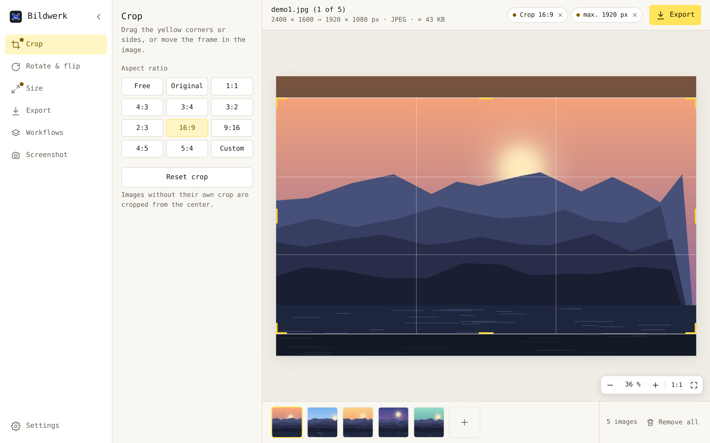

# Bildwerk

<picture>
  <source media="(prefers-color-scheme: dark)" srcset="docs/screenshot-dark.png">
  <source media="(prefers-color-scheme: light)" srcset="docs/screenshot-light.png">
  
</picture>

A lightweight image editor for **Windows, macOS and Linux** – crop, rotate, resize and export
single images or whole batches, save your settings as reusable workflows, and take screenshots
(including long scrolling captures) straight into the editor.

Built with [Tauri 2](https://tauri.app): a small Rust core and the system's own web view, so the
installers are only about 5–10 MB. The same interface also runs as a web app in any browser.

[Deutsche Version](README.de.md)

## Features

- **Batch processing** – drop in as many images as you like; every setting applies to the whole
  batch. Progress bar with time remaining and cancel when loading or exporting.
- **Crop** – free or with aspect ratio presets (1:1, 4:3, 3:2, 16:9, 9:16, 4:5 …) or a custom ratio;
  drag the corners or the sides.
- **Rotate & flip** in 90° steps.
- **Maximum resolution** – limit width and/or height, keep the aspect ratio; images are never upscaled.
- **Export** as JPEG, WebP or PNG with selectable quality and a live file-size estimate. In the
  desktop app a batch goes straight into a folder; in the browser it's downloaded as a ZIP.
- **Workflows** – save the current settings under a name and apply them again with one click;
  import/export as JSON.
- **Screenshots** (desktop app) – region, window, full screen and **scrolling capture** for long web
  pages or folders, with a global shortcut. Captures land in the editor and on the clipboard.
- **Zoom** for precise cropping (up to 1600 %, sharp pixels from 200 %).
- **At a glance** – tools that currently change the images are marked, and active adjustments are
  shown as chips at the top that can be reset individually.
- **Customizable toolbar** – right-click the tools to add, remove and reorder them.
- German and English, light/dark/system theme, simple and advanced mode, adjustable icon and text size.
- **Automatic updates** via GitHub Releases (signed).

## Download

Installers are published under [Releases](https://github.com/Olcay91/Bildwerk/releases):

| System  | File                                       |
|---------|--------------------------------------------|
| Windows | `Bildwerk_x.y.z_x64-setup.exe` or `.msi`   |
| macOS   | `Bildwerk_x.y.z_universal.dmg`             |
| Linux   | `.AppImage`, `.deb` or `.rpm`              |

The installers are not signed with a paid certificate yet. On first launch Windows SmartScreen may
warn you (“More info → Run anyway”); on macOS right-click the app → Open.

## Using Bildwerk

### Tools

Click a tool in the sidebar to open its panel, click it again to close it. Settings live in their own
window: the gear at the bottom left, or **⌘ ,** on macOS / **Ctrl + ,** on Windows and Linux.

### Image view and zoom

- **Ctrl + mouse wheel** (or a pinch on the trackpad) zooms at the pointer.
- `+` / `−` zoom, `0` fits the image, `1` shows 100 %. The buttons at the bottom right do the same.
- When zoomed in, pan by dragging outside the crop frame, with the middle mouse button,
  Space + drag or the mouse wheel.

### Screenshots

Turn them on under **Settings → Screenshots**. There you set a system-wide shortcut
(default: Ctrl + Alt + S), the start mode and the file format. When you trigger a screenshot,
Bildwerk hides, freezes the screen and lets you choose:

- **Region** – drag a rectangle.
- **Window** – click a window (it is highlighted).
- **Full screen** – click or press Enter.
- **Scrolling** – drag over the scrolling area or click a window. Bildwerk scrolls automatically,
  waits for content that loads later (endless pages), stitches everything into one long image and
  finishes on its own at the end of the page. Fixed headers and footers appear only once.
  Tip: select just the scrolling part – fixed sidebars or scrollbars would otherwise repeat.

Keys `1`–`4` switch the mode, `Esc` cancels.

**macOS:** screen capture needs the permission *Screen & System Audio Recording*
(System Settings → Privacy & Security). Bildwerk only captures images, no audio. macOS ties this
permission to the app's code signature, so unsigned builds are treated as a new app after every
rebuild – see [Building on macOS](#building-on-macos). Auto-scroll additionally asks for
*Accessibility*.

**Linux:** the global shortcut and window detection need X11; under Wayland use the screenshot
button in the toolbar.

## Building from source

Requirements: [Rust](https://rustup.rs) (stable) and [Node.js](https://nodejs.org) (LTS).

- **Windows:** Visual Studio Build Tools with *Desktop development with C++* (WebView2 is part of Windows 10/11).
- **macOS:** `xcode-select --install`
- **Debian/Ubuntu:**
  `sudo apt install libwebkit2gtk-4.1-dev build-essential curl wget file libxdo-dev libssl-dev libayatana-appindicator3-dev librsvg2-dev libxcb1-dev libxrandr-dev libdbus-1-dev libpipewire-0.3-dev libwayland-dev libegl-dev libgbm-dev clang`

```bash
npm install
npm run dev      # start in development mode
npm run build    # build the installers
```

The installers end up in `src-tauri/target/release/bundle/` (`nsis`, `msi`, `dmg`, `macos`,
`appimage`, `deb`, `rpm`). Each system can only build installers for itself; the GitHub workflow
builds all three at once (**Actions → Bildwerk bauen → Run workflow**).

### Building on macOS

To keep the screen recording permission across rebuilds, sign with a fixed identity:

1. Keychain Access → Certificate Assistant → Create a Certificate: name “Bildwerk Development”,
   identity type **Self-Signed Root**, certificate type **Code Signing**.
2. `export APPLE_SIGNING_IDENTITY="Bildwerk Development"` and `npm run build`.
3. Copy the app to /Applications and start it from there. Reset old entries with
   `tccutil reset ScreenCapture de.bildwerk.editor`.

### Font

The interface uses **Office Code Pro Regular** (SIL Open Font License 1.1,
[nathco/Office-Code-Pro](https://github.com/nathco/Office-Code-Pro)). Put
`OfficeCodePro-Regular.woff2` (or `.woff`/`.otf`) and its license file into `src/fonts/`.
Without it Bildwerk falls back to an installed Office Code Pro / Source Code Pro or the system's
monospace font.

## Project structure

```
src/                  Interface: index.html, style.css, app.js
  i18n.js             English texts (the interface is written in German)
  scroll.html/.js     Control bar of the scrolling capture
src-tauri/            Desktop app (Rust)
  src/lib.rs          Saving files, app setup
  src/capture.rs      Screenshots: screen, windows, clipboard, macOS permission
  src/scroll.rs       Scrolling capture: following and stitching the region
  src/menu.rs         macOS menu bar
  tauri.conf.json     Window, security policy, installers, updater
.github/workflows/    Builds for Windows, macOS and Linux
docs/                 Screenshots for this README
```

## Translations

Texts are written in German in the code. `src/i18n.js` maps them to English: fixed texts in the
`EN` dictionary, texts with numbers or names as patterns in `EN_RX`. A missing entry simply stays
German in the English interface.

## Releasing and automatic updates

One-time setup:

1. Create a signing key: `npm run tauri signer generate -- -w ~/.tauri/bildwerk.key`
   (keep the password; never publish `bildwerk.key`).
2. In `src-tauri/tauri.conf.json` set `plugins.updater.pubkey` to the content of
   `~/.tauri/bildwerk.key.pub` and `bundle.createUpdaterArtifacts` to `true`.
3. Add the repository secrets `TAURI_SIGNING_PRIVATE_KEY` (content of `bildwerk.key`) and
   `TAURI_SIGNING_PRIVATE_KEY_PASSWORD` under *Settings → Secrets and variables → Actions*.

For each release:

1. Bump the version in `src-tauri/tauri.conf.json`, `src-tauri/Cargo.toml`, `package.json` and
   `APP_VERSION` in `src/app.js`.
2. Add the changes to `CHANGELOG` in `src/app.js` and to `CHANGELOG.md`.
3. Push a tag, e.g. `git tag v0.3.1 && git push --tags`, and publish the draft release the workflow creates.

Installed copies then offer the update and show the changes once after updating.

## License

No license has been chosen yet.
